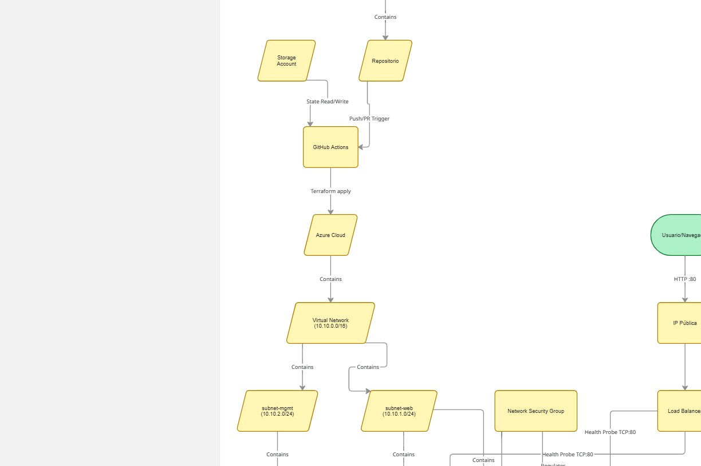
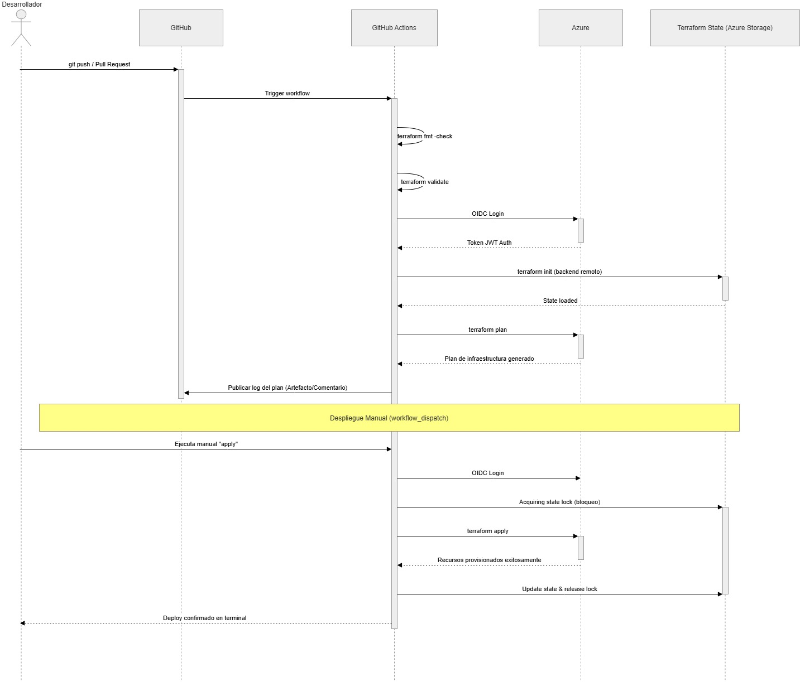

# Infraestructura como Código con Terraform (Azure) - Load Balancing


---

## Descripción
Este proyecto implementa una solución de **Infraestructura como Código (IaC)** para desplegar de manera automatizada y reproducible una arquitectura de alta disponibilidad en Microsoft Azure utilizando **Terraform**. Se instancia un balanceador de carga público (L4) que distribuye el tráfico hacia un backend pool compuesto por múltiples máquinas virtuales Linux.

El proyecto destaca por integrar:
- **Infraestructura Modular:** Recursos divididos en módulos reutilizables lógicos (`VNet`, `Compute`, `LB`).
- **Backend Remoto Seguro:** Estado de Terraform (`.tfstate`) alojado en un Azure Storage Account con soporte de _State Locking_.
- **Seguridad Perimetral:** Network Security Group (NSG) configurado para tráfico HTTP público (80) y SSH restringido (22) únicamente a IPs autorizadas.
- **Aprovisionamiento Automático:** Configuración _zero-touch_ de los servidores instalando Nginx automáticamente mediante scripts `cloud-init`.
- **CI/CD Automatizado:** Integración de pipelines con GitHub Actions usando autenticación OIDC segura.

---

## Integrantes
| Nombre | Rol |
|--------|-----|
| **Ana Fiquitiva** | Desarrolladora Principal |

---

## Arquitectura del Sistema

### Diagrama de Componentes


### Diagrama de Secuencia - CI/CD


---

## Reflexión Técnica y Análisis de Decisiones

### 1. Balanceador L4 (Estándar) vs Application Gateway (L7)
| Aspecto | Load Balancer (L4) | Application Gateway (L7) |
|---------|-------------------|------------------------|
| **Capa OSI** | Transporte (TCP/UDP) | Aplicación (HTTP/HTTPS) |
| **Decisión de Ruteo** | IP + Puerto | URL path, headers, cookies |
| **SSL Termination** | No | Sí |
| **WAF (Seguridad)** | No | Sí (opcional) |
| **Costo** | ~$18/mes (Standard) | ~$175/mes (v2 Standard) |

**Justificación:** Se optó por el Load Balancer L4 debido a la simplicidad del caso de uso (servir una página web básica por protocolo HTTP en el puerto 80). Application Gateway habría introducido un costo 10 veces mayor y una complejidad innecesaria. Para escenarios más robustos, como microservicios que requieren _path-based routing_ (ej. `/api`, `/admin`) o cifrado SSL/TLS, Application Gateway sería la elección técnica adecuada.

### 2. Implicaciones de Exponer el Puerto SSH (22/TCP)
Exponer el puerto nativo de administración a Internet acarrea riesgos como atraque de fuerza bruta, escaneo de puertos y aprovechamiento de vulnerabilidades *Zero-Day* en el daemon.

**Mitigaciones implementadas en esta arquitectura:**
- **Autenticación RSA/ed25519 Segura:**  Uso exclusivo de llaves criptográficas SSH, deshabilitando contraseñas para frenar ataques de diccionario.
- **Micro-segmentación por IP Personal:** Implementación de un NSG (Network Security Group) que admite tráfico al puerto 22 solo desde nuestra IP pública dinámica asignada (`186.29.35.50/32`). Exponiendo un `0.0.0.0/0` se estaría violando un principio fundamental de seguridad.

### 3. Estimación de Costos Operativos (Región: `eastus2`)
Basados sobre una retención de 1 mes completo ininterrumpido a full capacidad:

| Recurso | SKU | Costo/mes (aprox.) |
|---------|-----|-------------------|
| 2× VM Standard_B1s | 1 vCPU, 1 GB RAM | ~$7.59 × 2 = **$15.18** |
| Load Balancer Standard | 5 reglas base | ~**$18.25** |
| IP Pública Standard | Estática | ~**$3.65** |
| 2× Disco OS (30 GB) | Standard_LRS | ~$1.20 × 2 = **$2.40** |
| Storage Account (State) | Standard_LRS | ~**$0.10** |
| VNet + NSG Autónomo | — | **Gratuito** |
| **TOTAL ESTIMADO** | | **~$39.58/mes** |

> *Nota: Con una suscripción educativa (Azure for Students -$100), la persistencia del proyecto permite unos dos meses de operación continuada; sin embargo, se recomienda aplicar una destrucción remota activa finalizada la práctica.*

### 4. Mejoras Arquitectónicas para Entornos Productivos Reales (Producción)
Si este despliegue formase parte de una salida a negocio, se harían las siguientes implementaciones:
- **Resiliencia (VMSS):** Instanciar un `Virtual Machine Scale Set` escalable y reactivo en vez de un bloque discreto y fijo de máquinas.
- **Aislamiento Perimetral (Bastion):** El uso de **Azure Bastion** evitaría exponer directamente el SSH por una interfaz de red pública, permitiendo loggueos vía consola RDP web encriptada internamente.
- **Cifrado Restringido:** Manejar _Vaults_ como `Azure Key Vault` para los `.tfvars` de entornos controlados y utilizar WAF para contrarrestar ataques DDoS sobre las APIs de la Web.
- **Observabilidad Completa:** Configurar `Azure Monitor` y `Application Insights` para alertamiento automático de saturación en CPUs o de un fallo en la salud del `Probe` del LB.

### 5. Retos Opcionales Abordados (Evaluación)
Para llevar el laboratorio más allá del aprovisionamiento base, se exploraron y maquetaron lógicamente (sin despliegue estricto para ahorro de la cuota estudiantil) dos retos principales de la rúbrica:
1. **Acceso Seguro Sin IP Pública (Azure Bastion):** Se planteó la arquitectura para provisionar un _Bastion Host_ dentro de una `AzureBastionSubnet` exclusiva. Su objetivo habría sido enrutar el tráfico SSH de administración por una vista web TLS sin necesidad de que el Network Security Group admitiera conexiones públicas en el puerto 22, logrando una estrategia legítima de _Zero-Trust_.
2. **Alertas de Monitoreo y Presupuesto (Azure Monitor):** Se investigó la incorporación del recurso `azurerm_monitor_metric_alert` para gatillar alarmas según el estado del _Health Probe_ (métrica `DipAvailability`). Sumado a esto, un `azurerm_consumption_budget_resource_group` limitaría operativamente el Resource Group a $35 USD enviando notificaciones para prevenir desbordamientos en la factura de la suscripción de Azure.

---

## Software y Herramientas Requeridas
Si deseas probar este repositorio de manera local, necesitas:
| Componente | Versión | Tipo de Descarga |
|-----------|---------|-----------|
| Terraform | 1.14+ | [developer.hashicorp.com](https://developer.hashicorp.com/terraform/downloads) |
| Azure CLI | 2.84+ | [learn.microsoft.com](https://learn.microsoft.com/en-us/cli/azure/install-azure-cli) |
| Git | Cualquiera | [git-scm.com](https://git-scm.com) |
| Clave SSH | ed25519 | Generada localmente en la máquina del dev |

---

## Guía de Configuración Rápida

### 1. Clonar el Repositorio
```bash
git clone https://github.com/AnaFiquitiva/Lab_P8_Terraform_Azure_LoadBalancing.git
cd Lab_P8_Terraform_Azure_LoadBalancing-1
```

### 2. Autenticación Operativa
Abre una terminal y autentícate sobre Azure CLI:

```bash
az login
```
Asegúrate de que estás autenticado sobre la suscripción Azure que deseas que corra tus recursos desplegables.

### 3. Configuración Inicial (Root Module)
En el directorio `infra/` asegúrate de ajustar tus variables en el archivo de entorno `env/dev.tfvars`:

```hcl
subscription_id     = "TU_SUBSCRIPTION_ID"
prefix              = "lab8"
location            = "eastus2"
vm_count            = 2
admin_username      = "student"
ssh_public_key      = "~/.ssh/id_ed25519.pub"
allow_ssh_from_cidr = "TU_IP_PUBLICA/32"
```

### 4. Inicializar Terraform y Validar
```bash
cd infra

# Inicializar módulos locales empalmados remotos en tfstate
terraform init -backend-config=backend.hcl

# Formatear el código de validaciones de reglas
terraform fmt -recursive
terraform validate
```

### 5. Planificar y Desplegar
```bash
# Simular mapeo de estructura contra tu plan .tfvars
terraform plan -var-file=env/dev.tfvars -out plan.tfplan

# Aplicar los cambios en ambiente a demanda
terraform apply plan.tfplan
```

---

## Verificación de Funcionalidad Operativa

Una vez el despliegue finaliza, el output interactivo de la CLI entregará la `IP Pública` del Balanceador de Carga amarrado en front-end. 
Puedes probar su correcta asociación web corriendo un check sobre consola o mediante navegador:

```bash
# Protocolo GET al puerto 80 del DNS de Balanceo
curl http://[IP_PUBLICA_DEL_LB]
```

Se deberá percibir que el "Probe" del Load Balancer deriva tu tráfico de forma saludable hacia una de las `Ubuntu LTS` internas entregando un Documento HTML de Nginx como prueba de éxito total.

---

## Limpieza y Control de Facturación
> :warning: **PRECAUCIÓN DE COSTOS:** Recuerda purgar todos los recursos al culminar la verificación para desviar un gasto pasivo en el tenant de Azure.
```bash
terraform destroy -var-file=env/dev.tfvars -auto-approve
```

---

## Estructura del Proyecto
```text
Lab_P8_Terraform_Azure_LoadBalancing-1/
├── README.md                             # Documentación Central (Este archivo)
├── infra/                                # Root Module de Terraform
│   ├── main.tf
│   ├── providers.tf
│   ├── variables.tf
│   ├── outputs.tf
│   ├── backend.hcl                       # Configuración de Estado en Storage Blob
│   ├── cloud-init.yaml                   # Custom Scripting: Instalador asíncrono Nginx
│   └── env/
│       └── dev.tfvars                    # Entorno Variables Aisladas
├── modules/                              # Abstracción Modularizada
│   ├── vnet/                             # Azure Virtual Networks Subnets Layers
│   ├── compute/                          # Azure Virtual Machines + Interfaces
│   └── lb/                               # Azure Public LoadBalancer + Health Probes
└── .github/workflows/
    └── terraform.yml                     # Autenticación OIDC Continuous Integration
```

---

## Autor
**Ana Fiquitiva**  
Escuela Colombiana de Ingeniería Julio Garavito  
Arquitectura de Software (ARSW)  
Email: ana.fiquitiva-p@mail.escuelaing.edu.co

---

## Licencia
Este proyecto está licenciado bajo **Creative Commons Attribution-NonCommercial 4.0 International License** (CC-BY-NC 4.0).

Términos simplificados:
- Compartir y adaptar el código
- Uso educativo permitido
- Uso comercial no permitido sin autorización
- Atribuir a los autores originales

---

**Desarrollado en la Escuela Colombiana de Ingeniería Julio Garavito**

*Arquitectura de Software - ARSW*
