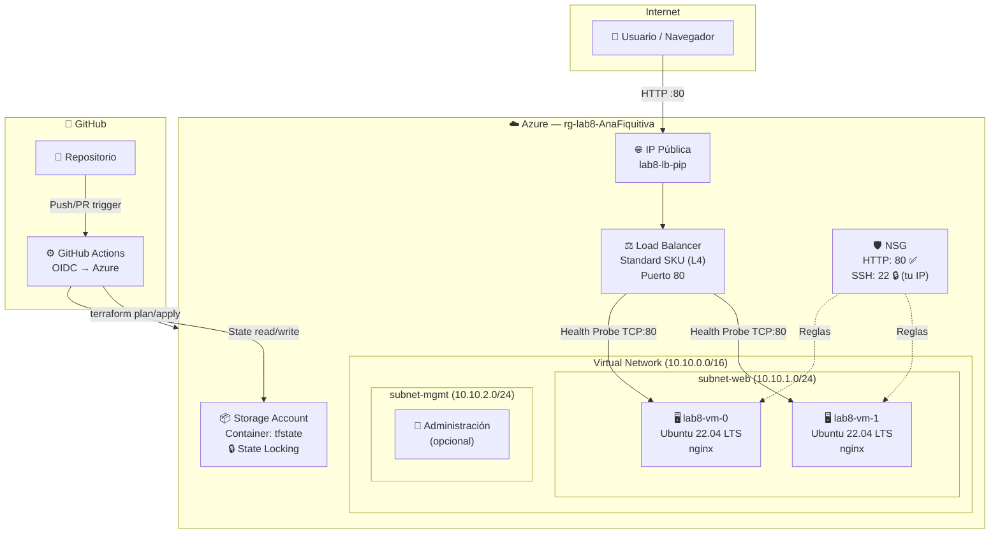
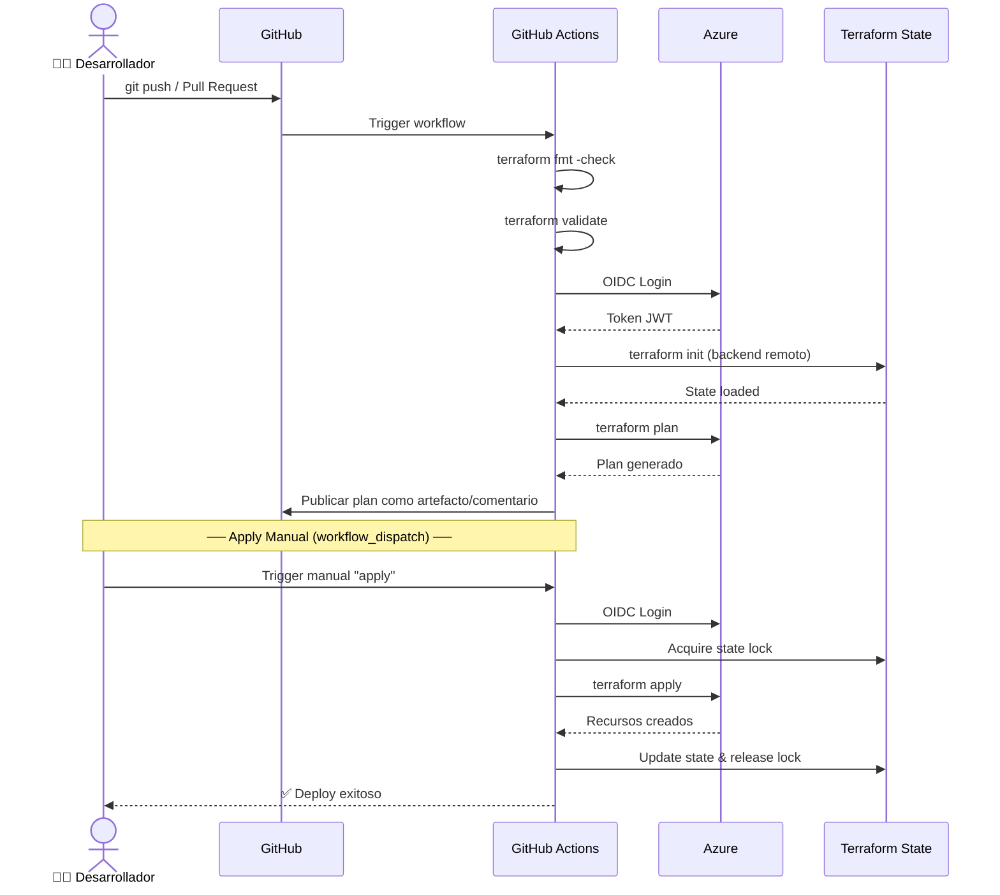
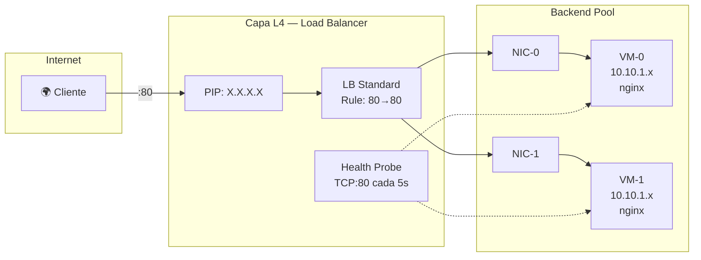

# Arquitectura y Reflexión Técnica — Lab #8

## Diagrama de Componentes



## Diagrama de Secuencia — Flujo de Despliegue



## Diagrama de Red



---

## Reflexión Técnica

### 1. ¿Por qué Load Balancer L4 vs Application Gateway L7?

| Aspecto | Load Balancer (L4) | Application Gateway (L7) |
|---------|-------------------|------------------------|
| **Capa OSI** | Transporte (TCP/UDP) | Aplicación (HTTP/HTTPS) |
| **Decisión de ruteo** | IP + Puerto | URL path, headers, cookies |
| **SSL Termination** | No | Sí |
| **WAF** | No | Sí (opcional) |
| **Costo** | ~$18/mes (Standard) | ~$175/mes (v2 Standard) |
| **Complejidad** | Baja | Media-Alta |

**Decisión**: Usamos L4 porque el caso de uso es simple (servir una página HTML via HTTP:80). No necesitamos routing basado en URL, SSL termination, ni WAF. El costo es **~10x menor** que Application Gateway.

**¿Qué cambiaría?** Si tuviéramos múltiples microservicios (ej. `/api`, `/web`, `/admin`), Application Gateway permitiría _path-based routing_ sin múltiples LBs. También sería necesario para HTTPS con certificados gestionados.

### 2. Implicaciones de Seguridad de SSH (22/TCP)

**Riesgos**:
- Ataques de fuerza bruta contra el servicio SSH
- Enumeración de usuarios
- Explotación de vulnerabilidades del daemon SSH

**Mitigaciones implementadas**:
- ✅ **SSH por clave** (no contraseña) — elimina fuerza bruta de passwords
- ✅ **NSG restrictivo** — SSH solo desde nuestra IP (`186.29.35.50/32`)
- ✅ **Sin IP pública en VMs** — acceso SSH solo a través de la subnet

**Mitigaciones adicionales para producción**:
- **Azure Bastion** — elimina la necesidad de exponer puerto 22 completamente
- **Just-In-Time VM Access** — abre el puerto SSH solo por ventanas de tiempo
- **Fail2ban** — bloquea IPs tras intentos fallidos
- **Deshabilitar root login** y login por password en `sshd_config`

### 3. Mejoras para Producción

| Área | Mejora | Beneficio |
|------|--------|-----------|
| **Resiliencia** | VM Scale Set (VMSS) con autoscaling | Escala automática según carga |
| **Resiliencia** | Availability Zones | Protección contra fallas de datacenter |
| **Seguridad** | Azure Bastion | Elimina SSH público |
| **Seguridad** | Azure Key Vault | Gestión segura de secretos |
| **Observabilidad** | Azure Monitor + Log Analytics | Métricas, alertas y logs centralizados |
| **Observabilidad** | Application Insights | Telemetría de aplicación |
| **Costos** | Budget Alerts | Notificaciones cuando se acerca al límite |
| **Costos** | Auto-shutdown en dev | Apaga VMs fuera de horario |
| **Networking** | HTTPS + TLS 1.3 | Cifrado en tránsito |
| **IaC** | Módulos versionados | Reuso y control de cambios |

### 4. Estimación de Costos (región eastus)

| Recurso | SKU | Costo/mes (aprox.) |
|---------|-----|-------------------|
| 2× VM Standard_B1s | 1 vCPU, 1 GB RAM | ~$7.59 × 2 = **$15.18** |
| Load Balancer Standard | 5 reglas LB | ~**$18.25** |
| IP Pública Standard | Estática | ~**$3.65** |
| 2× Disco OS (30 GB) | Standard_LRS | ~$1.20 × 2 = **$2.40** |
| Storage Account (tfstate) | Standard_LRS | ~**$0.10** |
| VNet + NSG | — | **Gratis** |
| **TOTAL ESTIMADO** | | **~$39.58/mes** |

> ⚠️ Con Azure for Students ($100 crédito), la infraestructura puede mantenerse ~2.5 meses. **Destruir al finalizar el lab con `terraform destroy`.**

### 5. Destrucción Segura

```bash
# 1. Verificar qué se destruirá
terraform plan -destroy -var-file=env/dev.tfvars

# 2. Ejecutar la destrucción
terraform destroy -var-file=env/dev.tfvars

# 3. Confirmar en el portal de Azure que no queden recursos
# 4. Opcionalmente, eliminar el Resource Group del state:
#    az group delete -n rg-tfstate-lab8 --yes
```
